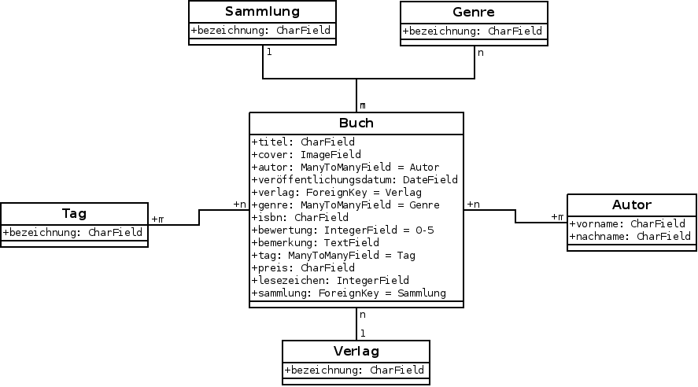

# Über
Das Projekt entstand im Rahmen des [Coding Contest](http://www.coding-contest.de/) 2012. Die verwendete Plattform ist dabei Python.

## Aufgabenstellung
	Du sollst eine Web Applikation schreiben, die zur Verwaltung von Büchern 
	dient - ganz im Sinne einer digitalen Bibliothek. Bei den Features hast 
	du freie Hand - es ist also deine Kreativität gefragt! Wer die Web Applikation
	mit einer API ausstattet, kann zusätzliche Punkte bekommen.

# Lösung
Die erstellte Webanwendung basiert auf [Django 1.4](http://djangoproject.com) und bindet weitere
Bibliotheken ein. Für den vollen Funktionsumfang sind folgende Vorraussetzungen erforderlich:

* Python 2.5 oder höher
* [docutils](http://docutils.sourceforge.net/)

## Installation

## Abgrenzung/Ausrichtung
Das entwickelte System ist primär für die Verwendung einer Person vorgesehen. Es gibt keine Benutzerverwaltung.

## Funktionsumfang

### Backend
Das Backend besteht aus 6 Klassen, deren recht einfach gehaltene Beziehungen nachfolgendes UML-Klassendiagramm darstellt:

### REST-Schnittstelle
Die Buch-Verwaltung besitzt eine [REST](http://de.wikipedia.org/wiki/Representational_State_Transfer)-Schnittstelle, die es in der Standard-Konfiguration ermöglicht von außen beliebig neue Objekte anzulegen, zu ändern oder zu löschen. Die verwendete Bibliothek ist dabei [Tastypie](http://tastypieapi.org/).

Eine Beispiel-Abfrage, welche alle gespeicherten Bücher als JSON zurückgibt, sehe mittels [Curl](http://curl.haxx.se/docs/httpscripting.html) wiefolgt aus:

`curl --user admin:admin http://localhost:8000/api/v1/buch/?format=json`

Für eine volle Dokumentation über den Funktionsumfang der Schnittstelle, siehe "[interacting with the API](http://readthedocs.org/docs/django-tastypie/en/latest/interacting.html)".

### Auto-Vervollständigung auf ISBN-Basis

### Suchfunktion
